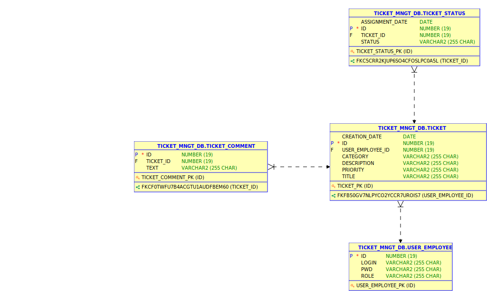

# simple-ticket-management


## Introduction

## Versions

- Java 17
- Maven 3.9.9
- Spring Boot 3.4.2
- JUnit 5

## ERD



## database configuration

Create a Docker container to run an Oracle 12c instance:

```
docker run -d --name TICKET_MANAGEMENT_DB -p 1521:1521  -e ORACLE_SID=xe -e ORACLE_PWD=oracle -e ORACLE_CHARACTERSET=UTF8 -e ORACLE_HOME=/u01/app/oracle/product/12.2.0/SE/ --memory="2g" quay.io/maksymbilenko/oracle-12c
```

Once created, use an Oracle database client like SQL developer and connect with following credentials:

- Login: sys as dba
- Password: oracle

Once connected, execute the following instructions:

```
create user ticket_mngt_db identified by 1234  default tablespace ticket_mngt_tablespace  temporary tablespace ticket_mngt_tablespace_temp;

grant create session to ticket_mngt_db;

create tablespace ticket_mngt_tablespace datafile 'ticket_mngt_tablespace.data'  size 10M autoextend on;

create temporary tablespace ticket_mngt_tablespace_temp tempfile 'ticket_mngt_tablespace_temp.data' size 5M autoextend on;

grant create session to ticket_mngt_db;
grant create table to ticket_mngt_db;
grant unlimited tablespace to ticket_mngt_db;
grant create sequence to ticket_mngt_db;
```

Connect to ticket_mngt_db user.

## Observations

As a Software Engineering Observation, H2 database was used for testing purposes, for simplicity reasons. It is not a recommended practice since the test database should be identical to main database.

